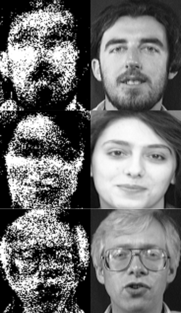

# ML attacks

This repo contains machine learning model attacks (membership inference, attribute reconstruction, ...)

## Model inversion attacks - Attribute reconstruction

The folder contains an implementation of one of the effective model inversion attacks described in the paper [Model Inversion Attacks that Exploit Confidence Information and Basic Countermeasures](https://rist.tech.cornell.edu/papers/mi-ccs.pdf). The paper describes the setting where an attacker tries to reconstruct attributes used to train machine learning models (image pixels for example) having only black-box access to a computer vision API. This extends the work done in [Privacy in Pharmacogenetics: An End-to-End Case
Study of Personalized Warfarin Dosing](https://www.usenix.org/system/files/conference/usenixsecurity14/sec14-paper-fredrikson-privacy.pdf) which showed the effectiveness of such attacks in recovering sensitive genomic information from logistic regression models, it also studied the effect of training models with differential privacy (ensuring that the model is not too sensitive to specific records) on attribute reconstruction effectiveness.

Many machine learning services for classification provide clients with query results such as an image class and a confidence score. The latter is usually derived from a machine learning classification layer (logit or softmax output...) and disclosed with high precision. This information can be used to deduce sensitive information about the records used in the machine learning process.

### Dataset

The datasets used is [AT&T faces](https://git-disl.github.io/GTDLBench/datasets/att_face_dataset/) it contains 40 distinct subjects varying the lighting, facial expressions (open / closed eyes, smiling / not smiling) and facial details (glasses / no glasses).

### Reconstruction

To demonstrate the attack, the model was originally designed to distinguish 40 classes.

Having only "black box" access to the machine learning model, an attacker cannot inspect the model parameters or modify them in any way. In reconstruction, an attacker starts with random images and tries to maximize the produced confidence scores. To do this, he can use the regularized gradient ascent  method.

### Results

Using a shallow machine learning model, the attack appears to be very effective. As described in the article, the images produced become less recognizable for deeper, more complex models.

    
    <figcaption>Reconstructed images</figcaption>

### References

[1] Fredrikson, Matt, Somesh Jha, and Thomas Ristenpart. "Model inversion attacks that exploit confidence information and basic countermeasures." Proceedings of the 22nd ACM SIGSAC conference on computer and communications security. 2015.

[2] Fredrikson, Matthew, et al. "Privacy in pharmacogenetics: An {End-to-End} case study of personalized warfarin dosing." 23rd USENIX security symposium (USENIX Security 14). 2014.